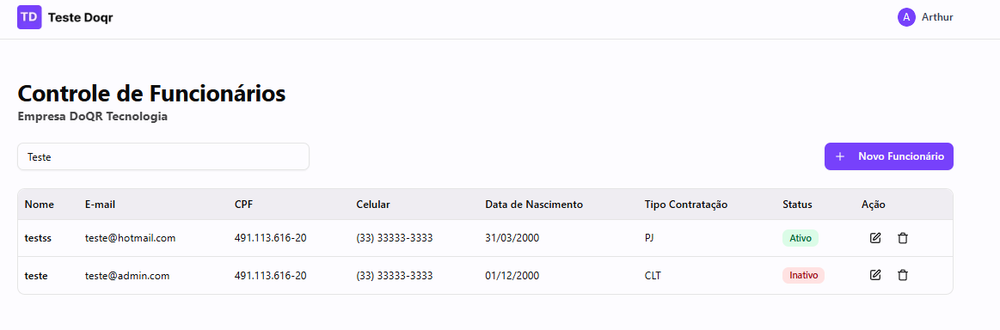

# Sistema de Controle de Funcionários

<br>
Desenvolvedor - Sistema de Gestão de Funcionários
<br><br>

[](https://www.linkedin.com/in/arthurcorream/)
[](https://www.instagram.com/arthurcoorrea/)

Ver: 0.1.0 - Last update: 14/09/2025

<br>

</div>

<div markdown="1">



# Sobre

O projeto consiste em um sistema de controle de funcionários. Nele é possível visualizar, criar, editar e excluir funcionários, além de realizar buscas e filtros. O sistema possui validações com zod e máscaras de entrada para campos formatados, também utiliza axios para o consumo dos endpoints e realiza testes E2E com cypress.

### Tecnologias

- Node 11.0.0+
- Next.js 15.5.3
- React 19.1.0
- TypeScript 5
- Tailwind CSS 4.1
- Zod 4.1.8
- React Hook Form 7.62.0
- Axios 1.12.1
- Lucide React 0.544.0
- Cypress 15.2.0
- Shadcn

<br>

# Instalação

Instale as dependências:

```
npm install
```

Rode o Projeto:

```
npm run dev
```

Execute os testes E2E:

```
npm run cypress:open
```

ou

```
npm run cypress:run
```

<br>

# Deploy

## [Clique aqui e veja a aplicação online](https://painel-de-funcionarios.vercel.app)

<br>

# Figma Project

```
https://www.figma.com/design/K0nlqqkiFTcnHgqEgpY5Wm/Teste---Gerenciar-Funcionários
```

##

<br>

# API Swagger

```
https://api-testefrontend.qforms.com.br/swagger/index.html
```

##

<br>

# Funcionalidades

- ✅ Busca e filtros em tempo real
- ✅ Cadastro de novos funcionários
- ✅ Edição de dados dos funcionários
- ✅ Exclusão de funcionários com confirmação
- ✅ Validação completa de formulários (CPF, telefone, email, etc.)
- ✅ Máscaras de entrada para campos formatados
- ✅ Interface responsiva
- ✅ Testes E2E automatizados com Cypress
- ✅ Gerenciamento de estado com localStorage
- ✅ Modal de boas-vindas para novos usuários

<br>

# Estrutura do Projeto

```
src/
├── app/                  # Páginas Next.js (App Router)
│   ├── page.tsx          # Pagina Home
│   └── employees/        # Diretório de Páginas de funcionários
│       ├── [id]/edit/    # Pagina de edição de funcionário
│       ├── new-employee/ # Pagina de cadastro de funcionário
│       └── page.tsx      # Pagina de funcionários
├── components/           # Componentes reutilizáveis
│   ├── ui/               # Componentes de UI
│   ├── Header/           # Componente do Header
│   └── Footer/           # Componente do Footer
├── hooks/                # Custom hooks
├── interfaces/           # Definições de tipos TypeScript
├── lib/                  # Utilitários e configurações
│   ├── api.ts            # Configuração da API
│   ├── masks.ts          # Máscaras e formatadores
│   ├── utils.ts          # Funções utilitárias
│   └── validations/      # Schemas de validação Zod
cypress/
├── e2e/                   # Testes end-to-end
└── support/               # Configurações do Cypress
```

---

<br>

Nomenclatura de commits

---

- docs: apenas mudanças de documentação;
- feat: uma nova funcionalidade;
- fix: a correção de um bug;
- perf: mudança de código focada em melhorar performance;
- refactor: mudança de código que não adiciona uma funcionalidade e também não corrigi um bug;
- style: mudanças no código que não afetam seu significado (espaço em branco, formatação, ponto e vírgula, etc);
- test: adicionar ou corrigir testes.

---

</div>
